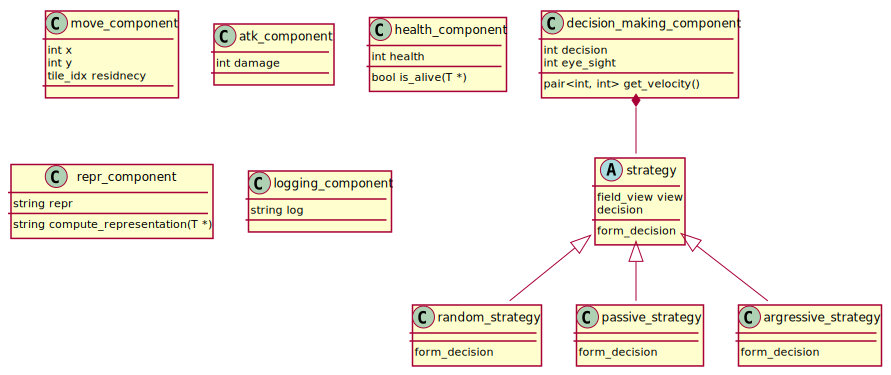
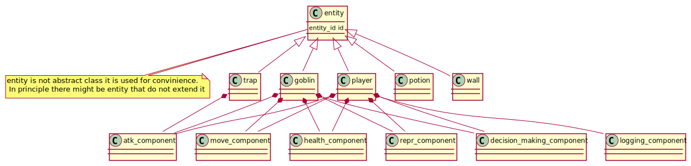
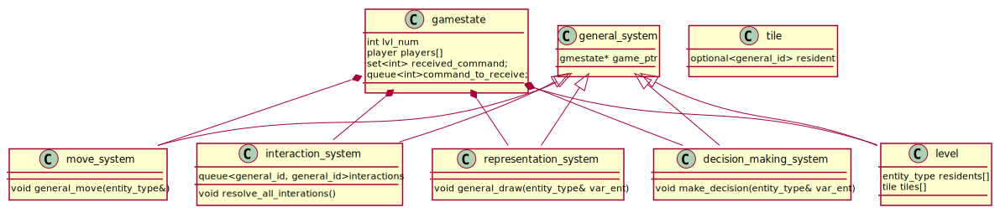

# Diagrams

<div hidden>

```
@startuml componentDigram
    class move_component {
        {field} int x
        {field} int y
        {field} tile_idx residnecy
    }

    class atk_component {
        {field} int damage
    }

    class health_component {
        {field} int health
        {method} bool is_alive(T *)
    }

    class repr_component {
        {field} string repr
        {method} string compute_representation(T *)
    }

    class decision_making_component {
        {field} int decision
        {field} int eye_sight
        {method} pair<int, int> get_velocity()
    }

    class logging_component {
        {field} string log
    }
    
    abstract strategy{
        {field} field_view view
        {field} decision
        {method} form_decision
    }
    
    class random_strategy{
        {method} form_decision
    }
    class passive_strategy{
        {method} form_decision
    }
    class argressive_strategy{
        {method} form_decision
    }
    
    decision_making_component *-- strategy
    
    strategy <|-- random_strategy
    strategy <|-- passive_strategy
    strategy <|-- argressive_strategy
    
     
		
@enduml
```

```
@startuml entityDigram
    note "entity  is not abstract class it is used for convinience.\n In principle there might be entity that do not extend it" as N

    class entity {
        {field} entity_id id
    }
    entity .. N

    class player 
    class potion
    class goblin
    class wall
    
    class move_component 
    class atk_component
    class health_component
    class repr_component
    class decision_making_component
    class logging_component
    

    entity <|-- player
    entity <|-- goblin
    entity <|-- potion
    entity <|-- wall
    entity <|-- trap
    
    player *-- health_component
    player *-- atk_component
    player *-- move_component
    player *-- decision_making_component
    player *-- logging_component
    player *-- repr_component
    
    goblin *-- health_component
    goblin *-- atk_component
    goblin *-- move_component
    goblin *-- decision_making_component
    goblin *-- repr_component
    
    trap *-- atk_component
    
@enduml
```

```
@startuml gameStructureDiagram

class gamestate{
    {field} int lvl_num
    {field} player players[]
    {field} set<int> received_command;
    {field} queue<int>command_to_receive;
}

class level{
    {field} entity_type residents[]
    {field} tile tiles[]
}

class tile{
    {field} optional<general_id> resident
}

class move_system{
    {method} void general_move(entity_type&)
}
class interaction_system{
    {field} queue<general_id, general_id>interactions
    {method} void resolve_all_interations()
}

class representation_system{
    {method} void general_draw(entity_type& var_ent)
}

class decision_making_system{
    {method} void make_decision(entity_type& var_ent)
}

class general_system{
    {field} gmestate* game_ptr
}

gamestate *-- level
gamestate *-- move_system
gamestate *-- interaction_system
gamestate *-- representation_system
gamestate *-- decision_making_system

general_system <|-- level
general_system <|-- move_system
general_system <|-- interaction_system
general_system <|-- representation_system
general_system <|-- decision_making_system


@enduml
```

</div>

## Type aliases

```c++
struct player_id{
    int value;
};
struct entity_id{
    int value;
};

using entity_type = std::variant<entity*, player*, .... etc>;
using general_id = std::variant<entity_id, player_id>;
```

## Components



## Entities



## Game structure


