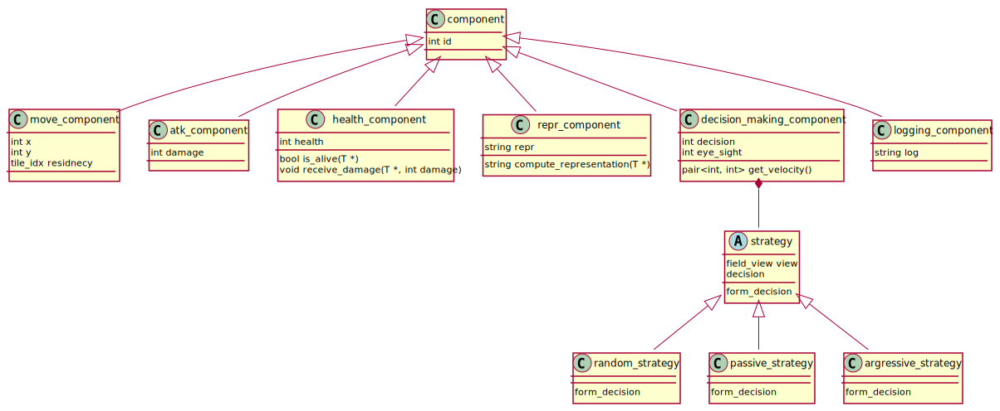
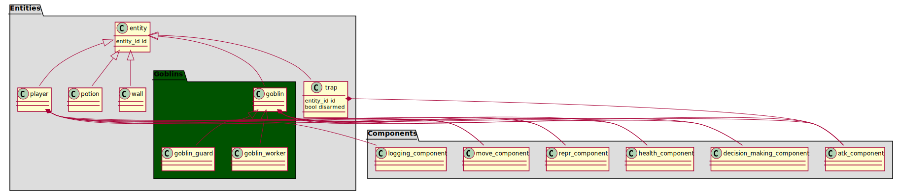
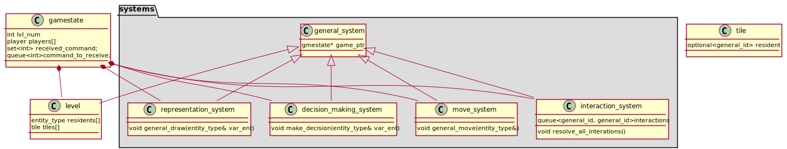

# Diagrams
For diagram rendering one need to run
```bash
    > pwd
    > <project_folder>/uml
    > plantuml -tsvg diagram.md 
```
<div hidden>

```
@startuml componentDigram
    class component{
        {field} int id
    }
    
    class move_component {
        {field} int x
        {field} int y
        {field} tile_idx residnecy
    }

    class atk_component {
        {field} int damage
    }

    class health_component {
        {field} int health
        {method} bool is_alive(T *)
        {method} void receive_damage(T *, int damage)
    }

    class repr_component {
        {field} string repr
        {method} string compute_representation(T *)
    }

    class decision_making_component {
        {field} int decision
        {field} int eye_sight
        {method} pair<int, int> get_velocity()
    }

    class logging_component {
        {field} string log
    }
    
    abstract strategy{
        {field} field_view view
        {field} decision
        {method} form_decision
    }
    
    class random_strategy{
        {method} form_decision
    }
    class passive_strategy{
        {method} form_decision
    }
    class argressive_strategy{
        {method} form_decision
    }
    
    component <|-- move_component
    component <|-- atk_component
    component <|-- health_component
    component <|-- repr_component
    component <|-- decision_making_component
    component <|-- logging_component
    
    
    decision_making_component *-- strategy
    
    strategy <|-- random_strategy
    strategy <|-- passive_strategy
    strategy <|-- argressive_strategy
    
     
		
@enduml
```

```
@startuml entityDigram
    package "Components" #DDDDDD {
        class move_component 
        class atk_component
        class health_component
        class repr_component
        class decision_making_component
        class logging_component
    }
    package "Entities" #DDDDDD {
        class entity {
            {field} entity_id id
        }
    
        class player 
        class potion
        class wall
        class trap {
            {field} entity_id id
            {field} bool disarmed
        }
        package "Goblins" #005300{
            class goblin
            class goblin_guard
            class goblin_worker
        }
    }
    
    
    

    entity <|-- player
    entity <|-- goblin
    entity <|-- potion
    entity <|-- wall
    entity <|-- trap
    
    goblin <|-- goblin_guard
    goblin <|-- goblin_worker
    
    player *-- health_component
    player *-- atk_component
    player *-- move_component
    player *-- decision_making_component
    player *-- logging_component
    player *-- repr_component
    
    goblin *-- health_component
    goblin *-- atk_component
    goblin *-- move_component
    goblin *-- decision_making_component
    goblin *-- repr_component
    
    trap *-- atk_component
    
@enduml
```

```
@startuml gameStructureDiagram

class gamestate{
    {field} int lvl_num
    {field} player players[]
    {field} set<int> received_command;
    {field} queue<int>command_to_receive;
}

class level{
    {field} entity_type residents[]
    {field} tile tiles[]
}

class tile{
    {field} optional<general_id> resident
}
package "systems" #DDDDDD{
    class move_system{
        {method} void general_move(entity_type&)
    }
    class interaction_system{
        {field} queue<general_id, general_id>interactions
        {method} void resolve_all_interations()
    }
    
    class representation_system{
        {method} void general_draw(entity_type& var_ent)
    }
    
    class decision_making_system{
        {method} void make_decision(entity_type& var_ent)
    }
    
    class general_system{
        {field} gmestate* game_ptr
    }
}


gamestate *-- level
gamestate *-- move_system
gamestate *-- interaction_system
gamestate *-- representation_system
gamestate *-- decision_making_system

general_system <|-- level
general_system <|-- move_system
general_system <|-- interaction_system
general_system <|-- representation_system
general_system <|-- decision_making_system


@enduml
```

</div>

## Type aliases

```c++
struct player_id{
    int value;
};
struct entity_id{
    int value;
};

using entity_type = std::variant<entity*, player*, goblin*, .... etc>;
using general_id = std::variant<entity_id, player_id>;
```

Note that there are no abstract classes except for strategies. If one want to 
implement entity or component outside of such hierarchy. The only condition for entities is that 
class that want to be treated like entity must provide `id` field of type `entity_id`. There is no such
condition for components.

## Components



## Entities



## Game structure


